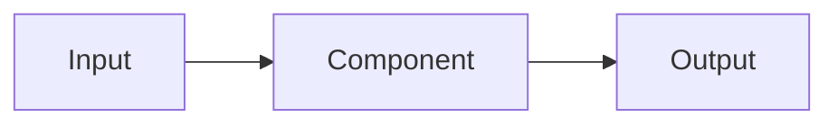

# Architecture: {{title}}

## Overview


## Components

### {{ComponentName}}
- **File**: `src/{{path}}`
- **Responsibility**:
- **Dependencies**:
- **Interface**:
```typescript
interface I{{ComponentName}} {
  // methods
}
```

## Data Flow


## Technology Choices
| Choice | Justification |
|--------|--------------|
|        |              |

## File Structure
```
src/
├── {{feature}}/
│   ├── {{component}}.ts
│   └── ...
```

## Testability Notes
-
